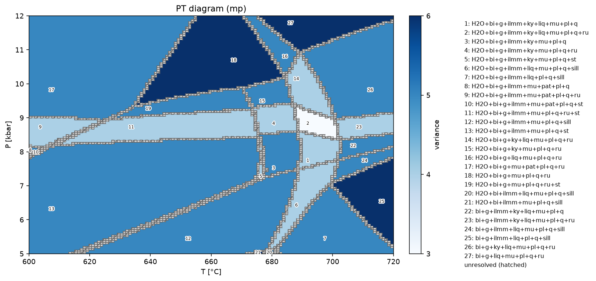
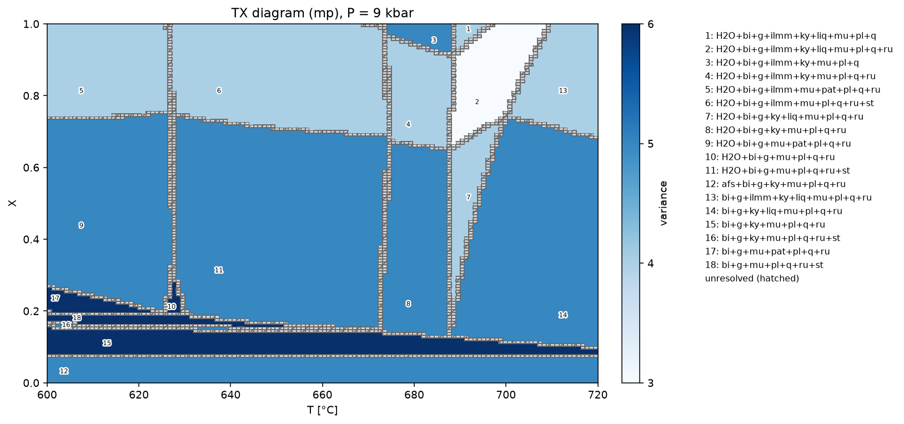
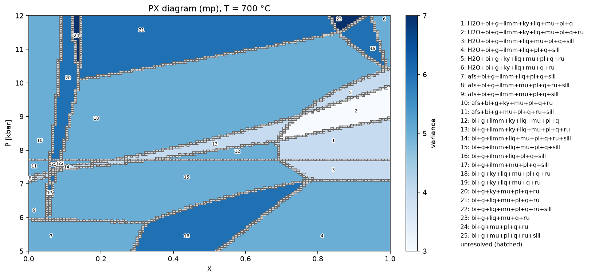
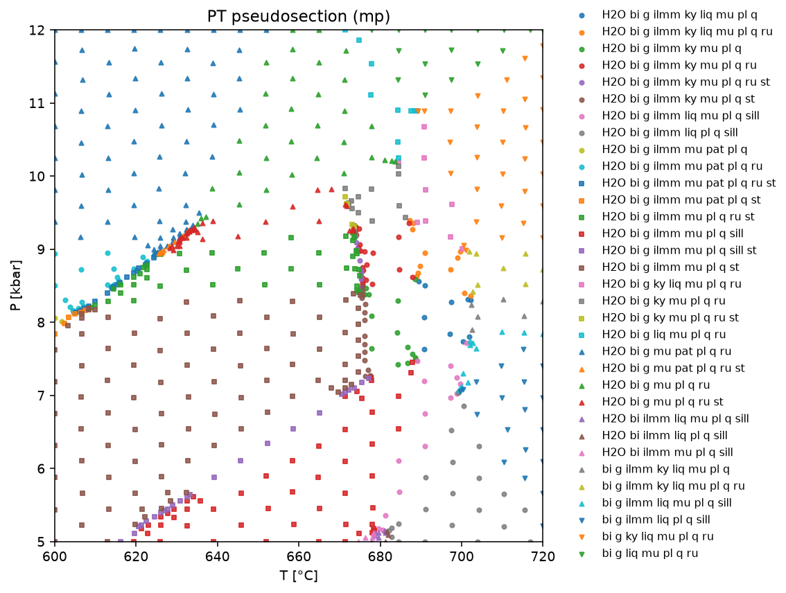

# Tutorial: building a metapelite PT pseudosection

This walks through building a real PT pseudosection step by step, using the `mp` (metapelite,
White et al. 2014) database, a specific bulk composition, and one solution phase suppressed. By
the end you'll have reproduced the figure at the bottom of this page.

Requires the optional `matplotlib` extra for the final plotting step:

```sh
pip install magemin[plot]
```

## 1. Pick a database and inspect what it offers

```python
from magemin import MAGEMin

with MAGEMin("mp") as mg:
    print(mg.oxide_names)
    print(mg.solution_phase_names)
```

```
('SiO2', 'Al2O3', 'CaO', 'MgO', 'FeO', 'K2O', 'Na2O', 'TiO2', 'O', 'MnO', 'H2O')
('liq', 'fsp', 'bi', 'g', 'ep', 'ma', 'mu', 'opx', 'sa', 'cd', 'st', 'chl', 'ctd', 'sp', 'mt', 'ilm', 'ilmm')
```

`oxide_names` is the order any bulk composition array must follow. `solution_phase_names` shows
the `mp` database actually has **two** ilmenite-group solution models: `ilm` and `ilmm`. This
tutorial suppresses `ilm`, keeping the newer `ilmm` model available -- see step 3 for why that
matters.

## 2. Define the bulk composition

Values below are in mol, in the exact order `oxide_names` reported above:

```python
bulk = [
    61.5428,  # SiO2
    10.7347,  # Al2O3
    1.2660,  # CaO
    3.2294,  # MgO
    5.3527,  # FeO
    2.1983,  # K2O
    1.5273,  # Na2O
    0.6297,  # TiO2
    0.1500,  # O
    0.1001,  # MnO
    13.2691,  # H2O
]
```

A plain list like this works with `compute()`/`PhaseDiagram` as long as you also pass
`sys_in="mol"` -- there's no need to wrap it in a `BulkRock` (that's just a convenience for
predefined, named compositions; see [Predefined bulk rocks](api/bulk_rocks.md)).

## 3. Suppress the `ilm` solution model

`suppress_phases` excludes named solution/pure phases from the minimization entirely -- useful
when you want to compare a pseudosection with and without a particular phase, or (as here) when a
database offers more than one model for essentially the same mineral group and you want to commit
to one of them (here, the newer `ilmm` model over the older `ilm` model). A quick single-point
check confirms it works and shows what's left stable:

```python
with MAGEMin("mp") as mg:
    result = mg.compute(
        P=8,
        T=650,
        bulk=bulk,
        sys_in="mol",
        suppress_phases=["ilm"],
        name_solvus=True,
    )
    print(result.ph)
```

```
('bi', 'ilmm', 'g', 'pl', 'mu', 'st', 'q', 'H2O')
```

With `ilm` suppressed, `ilmm` (the other ilmenite-group model) takes its place -- some databases
hard-code a single default variant for a near-degenerate phase-model pair like this one, so
`ilmm`'s pseudocompounds are only ever generated once something is being suppressed at all (see
[Suppressing phases](usage.md#suppressing-phases) for the mechanism). Without any
`suppress_phases`, `ilmm` can never appear regardless of P/T/bulk.

## 4. Build the pseudosection

[`PhaseDiagram.pt`][magemin.diagrams.PhaseDiagram.pt] takes it from here: a pressure range, a
temperature range, the same bulk/`sys_in`/`suppress_phases` arguments as `compute()`, and two knobs
controlling the adaptive mesh refinement --  `initial_resolution` (the starting grid is
`2 ** initial_resolution` cells per axis) and `refine` (how many further refinement rounds beyond
`initial_resolution` a cell can be subdivided through before being left as an unresolved boundary
cell). Higher `refine` sharpens reaction-line detail at higher compute cost:

```python
from magemin import PhaseDiagram

diagram = PhaseDiagram.pt(
    "mp",
    P=(5, 12),
    T=(600, 720),
    bulk=bulk,
    sys_in="mol",
    suppress_phases=["ilm"],
    initial_resolution=3,
    refine=4,
)

print(len(diagram.points), "points computed")
print(len(diagram.cells), "mesh cells")
print(len({c.assemblage for c in diagram.cells if c.resolved}), "distinct stable assemblages")
```

```
4231 points computed
3325 mesh cells
27 distinct stable assemblages
```

This takes roughly a minute on a modern multi-core machine -- `PhaseDiagram.pt` builds on
[`multi_point_minimization`][magemin.core.multi_point_minimization] internally, so every point
within a refinement round is computed in parallel automatically; see
[Many points in parallel](usage.md#many-points-in-parallel) for how that works if you want to tune
`max_workers`.

## 5. Plot it

```python
fig = diagram.plot()
fig.savefig("mp_pseudosection.png", dpi=140, bbox_inches="tight")
```



Pressure is on the vertical axis and temperature horizontal (`PhaseDiagram.plot()`'s convention
for PT diagrams). Each numbered field is one stable phase assemblage -- the number sits at the
centroid of that field's largest cell, and the legend on the right maps numbers back to full
assemblage names (deliberately without color swatches, since color means something else here).
Field color encodes the assemblage's Gibbs-phase-rule variance, `n_components - n_phases + 2`
(`n_components = 11` for `mp`, shown as `diagram.n_components`) -- read the exact value off the
colorbar. The hatched bands are cells `PhaseDiagram` couldn't fully resolve at `refine=4`
(`max_depth=7`); in practice these trace out the reaction lines themselves, most only one or two
cells wide at this resolution. Pass a larger `refine` to narrow them further (at roughly 2-3x
runtime per extra level in a diagram this densely subdivided), or `show_unresolved=False` to omit
them entirely.
Every visual choice here -- annotation size, legend/colorbar placement, unresolved-cell styling --
is a `plot()` keyword argument; see [`PhaseDiagram.plot`][magemin.diagrams.PhaseDiagram.plot] for
the full list.

Reading the diagram: garnet (`g`) and biotite (`bi`) are stable throughout this window. Melt
(`liq`) starts appearing from about 671 °C (the wet solidus is a curve, not a flat line -- its
exact position shifts with pressure). Staurolite (`st`) occurs in a lower-temperature field
spanning roughly 5-9.9 kbar, up to about 677 °C. Kyanite (`ky`) is restricted to the higher-
temperature, melt-bearing part of the diagram (above ~671 °C, roughly 7.2-11.8 kbar), while
sillimanite (`sill`) occupies the lower-pressure side (up to ~8.1 kbar) across a wider temperature
range down to about 619 °C -- together tracing the Al2SiO5 polymorph boundary cutting across the
diagram from lower-left to upper-right. With `ilm` suppressed, `ilmm` is stable across the full
temperature range but only at the lowest pressures shown, up to about 9.4 kbar.

## 6. Validating the pseudosection

[`PhaseDiagram.validate()`][magemin.diagrams.PhaseDiagram.validate] checks the same `diagram`
computed in step 4 for legitimate zero-phase-fraction field boundaries: every pair of nearby
resolved cells with different assemblages must differ by exactly one phase (the Gibbs-phase-rule
variance changing by one) or by a polymorph swap (e.g. kyanite/sillimanite).
"Nearby" bridges one shared unresolved buffer cell, since a real boundary between two resolved
fields almost always still has one straddling it at this resolution:

```python
print(diagram.validate())
```

```
False
```

`False` here doesn't mean the diagram is wrong -- it means at `refine=4` (`max_depth=7`) some of
this reaction network's many nearby invariant points haven't yet been pulled apart enough for both
sides of every boundary to independently resolve to a clean single- or double-phase (or polymorph
swap) difference. This is normal, not a bug: real multicomponent reaction networks often stay
partially unresolved even after substantial refinement -- see
[`refine()`](usage.md#validating-a-diagram) to push further.

## 7. A TX section between two bulk compositions

[`PhaseDiagram.tx`][magemin.diagrams.PhaseDiagram.tx] varies temperature against `X`, a bulk-
composition interpolation fraction between two end-members, at a fixed pressure -- useful for
seeing how the mineralogy of a rock changes along a compositional trend (e.g. a metasediment
mixing line) rather than along a P-T path. Two new bulk compositions, again in mol and `mp`'s
oxide order:

```python
bulk_a = [68.5281, 11.9531, 1.4097, 3.5960, 5.9602, 2.4478, 1.7007, 0.7011, 0.0100, 0.1114, 3.5819]
bulk_b = [59.4335, 10.3668, 1.2226, 3.1187, 5.1692, 2.1230, 1.4750, 0.6081, 0.2000, 0.0967, 16.1865]
```

`X=0` is `bulk_a` (more silica-rich, water-poor), `X=1` is `bulk_b` (less silica-rich, markedly
more hydrous -- 16.2 vs 3.6 mol H2O) -- every intermediate `X` linearly interpolates each oxide
between them. A section at fixed `P=9` kbar:

```python
tx = PhaseDiagram.tx(
    "mp",
    P=9,
    T=(600, 720),
    bulk_a=bulk_a,
    bulk_b=bulk_b,
    sys_in="mol",
    suppress_phases=["ilm"],
    initial_resolution=3,
    refine=4,
)
tx.plot()
```



18 distinct assemblages resolve here. Melt (`liq`) only appears above about 688 °C at this
pressure, and spans nearly the entire `X` range there except the water-poorest corner near
`bulk_a` (`X` below ~0.10) -- consistent with `bulk_b`'s much higher H2O content pushing its wet
solidus down, so the water-richer compositions start melting at a lower temperature than the
water-poorer end. With `ilm` suppressed, `ilmm` is confined to the water-richer half of the
composition range (`X` above ~0.66), stable there across the full temperature range; alkali
feldspar (`afs`) occupies the opposite corner, a narrow sliver below `X` ~0.07. Kyanite is stable
across the entire `X` range; sillimanite doesn't appear anywhere in this section. Two narrow
near-vertical unresolved bands (around 627 °C and 673 °C) mark compositionally-sensitive reactions
that barely shift in temperature across most of the `X` range, then resolve into the wider fields
on either side.

## 8. A PX section between the same two compositions

[`PhaseDiagram.px`][magemin.diagrams.PhaseDiagram.px] is the same idea with pressure varying
instead of temperature, at a fixed `T=700` °C:

```python
px = PhaseDiagram.px(
    "mp",
    P=(5, 12),
    T=700,
    bulk_a=bulk_a,
    bulk_b=bulk_b,
    sys_in="mol",
    suppress_phases=["ilm"],
    initial_resolution=3,
    refine=4,
)
px.plot()
```



25 distinct assemblages resolve here -- the most of any section, since it cuts across the most
reaction topology at once. Melt (`liq`) is present across the entire pressure and composition
range at this temperature. Kyanite (`ky`) and sillimanite (`sill`) again mark the Al2SiO5
polymorph boundary, splitting the diagram into a kyanite-bearing upper part (above ~7.7 kbar) and
a sillimanite-bearing lower part (up to ~7.7 kbar), each spanning the full `X` range. With `ilm`
suppressed, `ilmm` is confined to pressures up to about 9.9 kbar, spanning the full `X` range there.
Alkali feldspar (`afs`), as in the TX section, only stabilizes on the water-poorer side, `X` up to
about 0.32.

## 9. The same window, the Delaunay-mesh way

[`Pseudosection`][magemin.pseudosection.Pseudosection] is an alternative to `PhaseDiagram`, built
on the same `MAGEMin`/`multi_point_minimization` machinery but sampling a perturbed hexagonal
lattice, Delaunay-triangulated, and densified wherever two triangle-adjacent points disagree in a
way that isn't a legitimate boundary -- instead of `PhaseDiagram`'s axis-aligned quadtree grid.
It needs the optional `mesh` extra:

```sh
pip install magemin[mesh]
```

Same database, bulk, and `suppress_phases` as step 4, with `initial_resolution`/`refine` in the
same spirit (`refine` here counts densification rounds, not quadtree levels):

```python
from magemin import Pseudosection

mesh = Pseudosection.pt(
    "mp",
    P=(5, 12),
    T=(600, 720),
    bulk=bulk,
    sys_in="mol",
    suppress_phases=["ilm"],
    initial_resolution=4,
    refine=6,
)

print(len(mesh.points), "points computed")
print(
    len({p.assemblage for p in mesh.points if p.assemblage is not None}),
    "distinct stable assemblages",
)
```

```
710 points computed
33 distinct stable assemblages
```

Far fewer points than step 4's quadtree diagram (710 vs. 4231) for a comparable number of distinct
assemblages (33 vs. 27) -- the hex lattice concentrates points near boundaries directly rather than
recursively subdividing whole cells, so it reaches a similar picture of the reaction network with
much less compute, at the cost of a fuzzier, unfilled view between points (see the plot below).

[`Pseudosection.validate()`][magemin.pseudosection.Pseudosection.validate] checks the same
clean-boundary-or-polymorph-swap criterion as `PhaseDiagram.validate()`, but pairwise over the
mesh's Delaunay edges directly -- there's no "unresolved cell" to bridge, since every point already
has a determinate assemblage (or none, on a failed computation):

```python
print(mesh.validate())
```

```
False
```

As in step 6, `False` doesn't mean anything is wrong -- some of this reaction network's invariant
points still have Delaunay edges crossing more than one reaction at once at this resolution.
[`Pseudosection.refine()`][magemin.pseudosection.Pseudosection.refine] continues densifying from
here, reusing every already-computed point:

```python
mesh = mesh.refine(refine=4)
```

[`Pseudosection.plot()`][magemin.pseudosection.Pseudosection.plot] renders a plain scatter instead
of `PhaseDiagram.plot()`'s filled regions -- one color/marker-shape combination per assemblage, no
annotation, no colorbar, no unresolved-cell shading:

```python
fig = mesh.plot()
fig.savefig("mp_mesh.png", dpi=140, bbox_inches="tight")
```



The same reaction network from step 5's filled diagram is visible here as point density rather
than filled regions: several diagonal and near-vertical bands of densely clustered, rapidly
alternating colors trace out the same reactions step 5 rendered as sharp boundary lines, against a
sparse, uniform scatter everywhere the assemblage stays constant. Reach for `PhaseDiagram` when you
want a filled, presentation-ready map with variance coloring and a legend; reach for
`Pseudosection` for a faster, exploratory first look at where a reaction network lives, or when the
mesh's point-cloud output is more convenient for downstream processing than a quadtree cell list.
